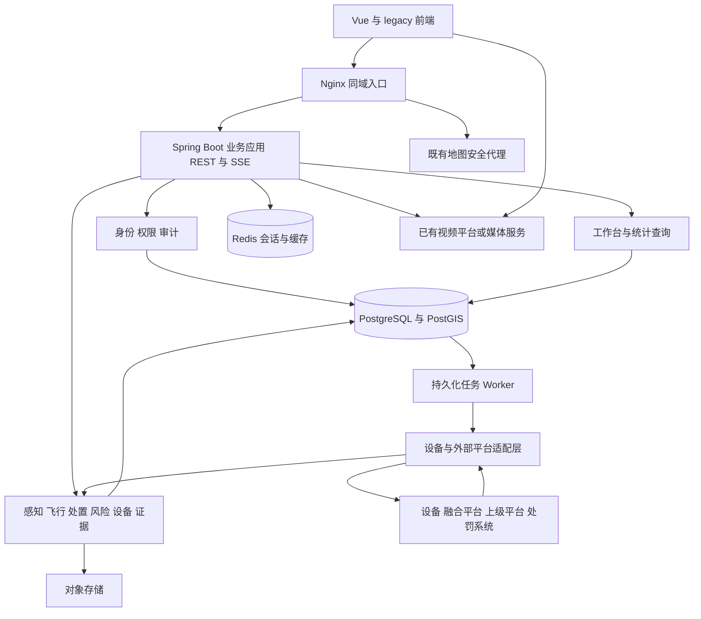

# 东营无人机融合感知与低空安全管理平台——后端项目搭建技术方案

版本：V1.0（技术评审稿）  
编制日期：2026-09-03  
前端基线：`demo-ronghe`，Git 提交 `76ea0a6`，结合当前工作区源码核查。  
交付性质：后端建设建议与实施边界；本文中的数据库、接口、部署资源与排期均为拟建方案，不表示已经实现或完成联调。

## 1. 建设结论与首期范围

建议新建独立后端仓库，采用 **Java 21 + Spring Boot 4.1.x + MyBatis + PostgreSQL/PostGIS**，以模块化单体起步，配套 Redis、对象存储、REST API 和 SSE 实时推送。设备接入通过独立适配层承接，视频由媒体服务承接。前端继续保持 Vue 3、JavaScript、Naive UI、npm 和现有 hash 路由。

首期目标是把当前前端已经形成的业务链变成可持久化、可鉴权、可并发操作、可追溯的服务，优先交付三条链路：

1. 无人机告警：告警触发 → 人工核实 → 一次人工发起联动反制 → 系统自动执行信号干扰 → 通知处罚部门。
2. 飞行计划风险：待核验 → 待通知 → 已通知；核验可分支进入已排除。
3. 设备异常：原因与确认 → 下发重启 → 等待设备回执 → 平台恢复校验 → 关闭本次异常。

三类流程独立建模，通过工作台统一查询。无人机流程完成通知代表处置交接完成，行政处罚办理另有状态与完成条件。首期不增加一条要求用户手工归档的无人机事件步骤。

技术方案以“单项目、单数据库事务域、可独立扩展接入层”为起点。暂不引入 Spring Cloud、服务注册中心、分布式事务、通用 BPMN 引擎、Kafka、Elasticsearch 或 Kubernetes 作为启动前提。后续是否引入由实际吞吐量、接入协议和运维条件决定。

### 1.1 规划假设与范围分级

当前未获得团队技术栈约束、设备协议原件、部署网络、国产化清单和实际容量。以下默认采用 Java 团队能够维护的 Linux 私有化部署；如果已有统一技术底座，以兼容性验证结果调整选型。

| 范围 | 首期处理方式 |
| --- | --- |
| 真实账号、组织范围、角色权限、审计 | 必须建设；生产账号由真实组织资料初始化 |
| 三类业务流程、关联证据、通知与回执 | 必须建设；外部动作以接口实际受理/执行结果推进 |
| 目标、轨迹、空域、航线、计划、设备台账 | 建设持久化模型和查询接口；先联通已具备资料的数据源 |
| 合法性和风险规则 | 提取现有确定性规则，保留未知值及依据；阈值标识已确认/待确认 |
| 统一事件标识 | 新建持久化索引与业务关联，不把现有拼接 key 当作全局业务主键 |
| 责任人、领取、转派、SLA、催办 | 路线图能力，后续单独定标；首期不自动填入虚构人员和时限 |
| 行政处罚完整办理 | 首期支持移交记录、已有真实案件数据查询和结果接收；立案、审批、文书模板等另行确认 |
| 多源融合算法 | 默认接收设备/融合平台输出；算法研发和模型训练单独立项 |
| 实时视频与回放 | 先确认已有视频平台；有真实流后再验收播放、截图和取证 |

## 2. 前端现状与后端承接依据

### 2.1 代码核查结果

| 已核查位置 | 当前真实情况 | 后端建设含义 |
| --- | --- | --- |
| `package.json`、`src/pages/registry.js` | Vue 3/Vite/Pinia/Naive UI；Vue 与经典脚本并存，`monitor` 仍由 legacy 承载 | 接口接入与页面迁移分开实施 |
| `src/config/navModel.js` | 默认工作台；飞行计划承接 `risk/airspace` 旧地址；用户与角色为独立菜单 | 后端按业务域划分，返回权限码及页面所需数据，保留旧路由 |
| `public/assets/js/mock.js` | 数据、字典、权限、规则、业务动作和自检集中于此 | 提取领域规则与字段映射，不能直接把随机数据生成器移到服务器 |
| `public/assets/js/case.js` | `EVT` 按目标聚合告警、处置记录、授权和证据；联动后续由定时器推进 | 建立持久化事件关联、受控指令和真实回执处理 |
| `src/services/workbenchEvents.js` | `uav:<targetId>`、`risk:<id>`、`device:<deviceId>` 为视图 key；设备异常保存在模块内 Map | 新增事件实例主键；同设备再次故障必须生成新实例 |
| `public/assets/js/pages/risk.js`、`M.RISK_FLOW` | 核验、排除、通知共用风险流程；通知记录与回执有独立字段 | 原样保留业务分支，不增加“转处置完成”等风险终态 |
| `public/assets/js/pages/monitor.js` | 重启约 2.6 秒后由浏览器定时器写入模拟成功回执并修改设备状态 | 持久化指令；设备成功回执和恢复验证分别处理 |
| `src/ui/counterAuthModal.js` | 已有设备/方式/时长及两项确认，但提交回调只传目标对象 | 正式接入必须提交用户选择的参数，并在服务端重新校验 |
| `M.notifyPunish` | 共享推进、审计和 `awaitingPunishment`；通知记录使用 `sessionStorage` | 交接、处置进度及审计事务化；处罚办理状态单独保存 |
| `src/services/accessControl.js`、`M.PERM` | 前端统一 `READ/OP/AUTH` 档位，当前账号可在演示中切换 | 真实会话、接口权限、数据范围、敏感字段必须后端执行 |
| `M.evidenceFiles`、`public/assets/js/video.js` | 文件台账和哈希为演示数据；视频是 Canvas 模拟画面 | 建设真实文件与媒体接入，不能据台账宣称文件已经存在 |
| `vite.config.js`、`src/services/weather.js` | 地图环境配置与生产安全代理已有约束；天气可降级 | 保留地图代理边界；业务接口失败不能伪装成成功或混入 Mock |

这些结论来自源码读取，未执行本次设备联调或浏览器流程验收。代码注释中的“真实回执”“已联调”“协议依据”不等于已取得设备方接口和验收材料。

### 2.2 与现有路线图的差异

`docs/整体改造方案.md` 与 `docs/事件驱动业务流程梳理.md` 包含更长远的统一事件、任务、SLA 和案件闭环设计。当前代码已有工作台，但尚无生产级统一事件主键、任务责任机制和真实后端。

部分存量描述也存在口径混用：`EVT.phase()` 的终态仍可显示“已结案”，而 `notifyPunish()` 已通过 `awaitingPunishment` 区分移交与处罚办结。正式接口必须分别返回处置阶段、交接状态、处罚办理状态，前端联调时统一展示口径。存量 `cases` 不应整体当作行政处罚立案记录导入。

## 3. 技术选型与版本管理

### 3.1 推荐组合

| 层次 | 推荐技术 | 在本项目中的用途 |
| --- | --- | --- |
| 语言/构建 | Java 21，Maven 3.9.x + Maven Wrapper | 统一开发、CI、部署运行时 |
| 应用框架 | Spring Boot 4.1.x，Spring MVC | REST、参数校验、事务、配置与健康检查 |
| 认证授权 | Spring Security + Spring Session | 本地登录或 OIDC 单点登录；服务端会话与接口权限 |
| 数据访问 | MyBatis Spring Boot Starter 4.0.x | 显式 SQL，便于空间查询、聚合统计和范围过滤 |
| 业务数据库 | PostgreSQL 17.x | 业务状态、关联记录、审计、指令、可靠任务 |
| 空间扩展 | PostGIS 3.5.x 稳定补丁版 | 点、航线、空域、距离与相交查询；与 PostgreSQL 17 组合验证 |
| 缓存/会话 | Redis 8.x，经部署环境确认维护版本 | 会话、权限版本失效通知、短期缓存和限流；不做业务唯一真源 |
| 数据库迁移 | Flyway，跟随 Boot BOM 并核验 PostgreSQL 模块 | 表、约束、索引、字典的版本化迁移 |
| 文件 | `ObjectStoragePort` + S3 兼容对象存储 | 原始报文、录像片段、截图、报告、文书；优先复用甲方存储 |
| 接口契约 | OpenAPI 3.1，springdoc-openapi 3.x | 接口、错误码、枚举、字段缺失语义及契约校验 |
| 实时更新 | REST + SSE | 用户动作走 REST，业务状态及采样后的态势变化走 SSE |
| 异步处理 | PostgreSQL Outbox/Inbox + 后台 Worker | 事务后发送、通知重试、回执去重、超时扫描、证据归集 |
| 运行监测 | Actuator + Micrometer + 结构化日志 | 健康、时延、错误率、任务积压、数据库与连接池指标 |
| 测试 | Boot 测试栈 + Testcontainers | 领域测试、真实 PostgreSQL/PostGIS 事务及接口集成测试 |
| 部署 | Linux、容器镜像、Nginx；联调环境使用 Compose | 同域入口、TLS、静态站点与接口反向代理 |

版本核查说明：截至本次检索，Spring 官方页面列出 Boot 4.1.1，要求 Java 17 及以上，因此 Java 21 在其兼容范围内；MyBatis Starter 官方列出 4.0 对应 Boot 4.0+；springdoc 官方说明 3.x 对应 Boot 4。以上是选型依据，完整组合仍须通过建仓时的启动、数据库、会话、序列化和 OpenAPI 冒烟验证。[Spring Boot 系统要求](https://docs.spring.io/spring-boot/system-requirements.html)、[MyBatis 兼容表](https://mybatis.org/spring-boot-starter/mybatis-spring-boot-autoconfigure/)、[springdoc 兼容表](https://springdoc.org/#what-is-the-compatibility-matrix-of-springdoc-openapi-with-spring-boot)

选择 PostgreSQL 17 是考虑空间扩展组合和维护窗口；官方当前仍支持该主版本，计划维护到 2029 年 11 月。PostGIS 3.5 文档列出对 PostgreSQL 17 的支持。[PostgreSQL 版本政策](https://www.postgresql.org/support/versioning/)、[PostGIS 3.5 文档](https://postgis.net/stuff/postgis-3.5.0-en.pdf)

后端仓库建立版本冻结清单，记录 JDK 发行版及补丁、Maven Wrapper、Boot BOM、独立依赖版本、镜像 digest、PostgreSQL/PostGIS 配对版本。生产不使用 `latest`、快照或预览版本。依赖更新通过兼容验证后统一发布；前端依赖不因后端建仓而变更。

### 3.2 关键取舍

- **模块化单体**：核实、处置记录、审计、事件摘要可以在一个事务内完成。首期团队无需同时维护多个服务的部署和分布式一致性。
- **PostgreSQL/PostGIS**：本项目有空域相交、航线走廊、空间距离和轨迹查询，优先使用数据库空间类型及索引。若甲方指定其他数据库，先做真实空间查询和迁移验证，再确认替代方案。
- **MyBatis**：业务查询和空间 SQL 明确可审查；Mapper 只能通过对应模块的应用服务调用，避免页面式拼装跨域写操作。
- **SSE**：当前浏览器主要接收数据更新，操作可用 REST 完成。只有出现高频双向协议需求时再增加 WebSocket，视频不经 SSE 传输。
- **代码状态机**：三条现有流程数量有限，枚举、迁移表、守卫和领域测试足以覆盖；任务和审批大幅扩展时再评估工作流引擎。

## 4. 总体架构与模块边界



首期 API 与 Worker 可在同一应用运行，通过独立线程池、数据库任务租约和资源限额隔离。设备协议需要 TCP 常驻连接或独立网络区时，将对应适配器部署成接入进程，以内部鉴权接口与业务应用通信。接入进程不跨越模块直接修改业务表。

| 模块 | 主要职责 | 对应前端入口/数据 |
| --- | --- | --- |
| `identity` | 用户、组织、角色、菜单授权、动作权限、会话、权限变更复核 | 用户管理、角色管理、`PERM/MENU_PERM/ROUTE_MODULES` |
| `sensing` | 数据源、目标、轨迹、来源标识映射、质量与新鲜度 | 融合感知、`allTargets/liveTargets/idLineage` |
| `flight` | 飞行计划、航线、空域及版本 | 飞行计划、`flightPlans/routes/airspaces/ruleVersions` |
| `assessment` | 计划匹配、合法性判定、事实修订、规则版本 | 合法性研判、`deriveLegality/PLAN_MATCH/factRevisions` |
| `uav` | 告警核实、处置记录、联动处置编排、交接 | 告警事件、处置与处罚、`EVT/DISPOSAL_FLOW` |
| `risk` | 飞行计划风险、核验/排除、通知上级 | 飞行计划风险页、`RISK_FLOW/RISK_IMPL` |
| `device` | 台账、心跳、健康、异常实例、调测任务、恢复验证 | 设备管理、监测、接入调测、`DEVICE_ACTIONS` |
| `command` | 授权记录、指令、回执、停止请求、超时与对账 | 联动反制、重启等所有受控设备动作 |
| `handoff` | 内部交接、外部发送、通报与送达/回执记录 | `notifyPunish/pushDispatchSync/riskNotices` |
| `evidence` | 文件元数据、上传下载、关联、保管冻结、存储状态 | 证据管理及处置页的证据详情 |
| `workbench` | 事件索引、跨域摘要、待办提示、时间线 | `workbenchEvents.js`；不拥有三类流程迁移权 |
| `reporting` / `audit` | 统一统计口径、导出作业；操作与访问审计 | 运行统计、日志归档、大屏 |
| `integration` | 厂商协议转换、外部平台接口、媒体及天气适配 | 接入台账、调测、视频、外部通知 |

模块内部按 `api → application → domain` 组织调用，数据库、外部 API 和存储实现放在 `infrastructure`。跨模块写入只能走公开应用服务。`workbench` 可组合只读查询，不得维护第二份业务状态机。

## 5. 后端仓库与启动工程

建议仓库名：`dongying-low-altitude-server`。初期一个 Maven 项目、一个可执行应用，业务模块按包隔离；不为每个菜单创建一个 Maven 子项目。

```text
dongying-low-altitude-server/
  pom.xml
  mvnw / mvnw.cmd / .mvn/
  README.md
  .env.example                    # 仅键名和空值
  src/main/java/<组织反向域名>/lowaltitude/
    Application.java
    platform/                     # 异常、鉴权上下文、审计、任务、时间与配置
    modules/
      identity/
      sensing/
      flight/
      assessment/
      uav/
        api/                      # Controller、请求与响应 DTO
        application/              # 核实、联动处置、交接等用例与事务
        domain/                   # 状态、迁移守卫、领域规则
        infrastructure/           # Mapper、Repository 实现
      risk/ device/ command/ handoff/ evidence/
      workbench/ reporting/ audit/
    integration/                  # 厂商、上级平台、媒体等适配器
  src/main/resources/
    application.yml
    application-local.yml
    application-test.yml
    application-prod.yml
    db/migration/                 # 正式表与基础字典
    mapper/
  src/test/                       # 领域、权限、契约、数据库及接入测试
  contract/                       # OpenAPI 与协议映射说明
  deploy/                        # Dockerfile、Compose、Nginx、部署说明
  docs/                          # 架构决策、数据字典、运行手册
```

### 5.1 建仓顺序

1. 初始化 Java/Maven/Boot，锁定依赖和 Wrapper，接入格式检查、依赖扫描及 CI；配置统一 JSON、异常、日志与 `traceId`。
2. 配置 PostgreSQL/PostGIS、Flyway 和最小数据访问；分离迁移账号、应用账号及只读运维账号，应用不持有建库/扩展管理权限。
3. 建立会话、CSRF、当前用户接口、组织范围、权限目录和审计；真实身份接入前，只允许在独立联调环境创建测试账号。
4. 建立幂等请求、事件索引、Outbox/Inbox、后台任务与时间抽象 `Clock`；为后续命令链提供基础。
5. 建立对象存储抽象、OpenAPI 导出与 SSE 框架，交付第一条可读写且有审计的业务切片。

首轮基础切片建议选择“设备列表 → 查看异常 → 提交重启请求 → 联调模拟器回调 → 平台恢复验证”。模拟器与生产设备适配器使用同一契约，标记 `simulation`，仅在联调环境启用；模拟通过不计为设备实联通过。

### 5.2 环境与配置

环境划分为 `local`、`test`、`staging`、`prod`。数据库、对象存储桶、外部回调地址和设备凭据按环境隔离。配置包括数据库、Redis、对象存储、OIDC、外部网关、允许来源、日志级别等，敏感值由部署系统注入。

开发端口建议：后端 `8080`，前端仍为 `5173`；前端开发服务器新增 `/api` 代理。生产统一由 HTTPS 域名提供静态站点、`/api/v1`、SSE 和 `/_AMapService`。管理监测端口仅对运维网络开放。

生产缺少关键鉴权、存储或真实接入配置时明确报错/禁用相关能力，不自动开启模拟模式。独立对象存储尚未准备时，可使用仅限本地开发的文件适配器，但必须在 staging 验证真实存储的上传、下载、权限与保管能力。

## 6. 核心数据模型

### 6.1 标识、状态与时间规范

- 内部主键建议统一使用 UUID；外部 JSON ID 全部为字符串。展示编号 `eventNo/commandNo` 独立生成，服务端保证唯一。
- 保留 `sourceSystem/sourceId` 和来源协议版本；外部编号允许跨厂商重复，唯一性必须带来源范围，不能直接作全局主键。
- 状态传输使用稳定英文枚举，并返回中文标签；legacy 字符串由适配层映射。不同业务对象的 `status` 不共用一张混杂字典。
- 业务时刻用 `timestamptz`，API 返回带时区的 ISO 8601；服务端存储与运算以 UTC 为基准，前端按 `Asia/Shanghai` 展示。
- 区分设备发生时刻、平台接收时刻和业务更新时间；校验时钟漂移。演示固定时间不进入生产判断。
- 可修改聚合具有 `version`；业务关系使用外键/唯一约束。原始报文、审计和回执追加保存，修正以新记录表达。
- 未知字段返回 `null` 和原因码，如 `NOT_PROVIDED/UNCONFIRMED/NOT_APPLICABLE/STALE`，不能用 0、成功或“合法”替代未知。

### 6.2 建议表组

下表为逻辑设计，具体字段、拆表和索引在数据库设计阶段确认，避免一开始为路线图创建大量空业务表。

| 表组 | 关键表及数据 | 约束重点 |
| --- | --- | --- |
| 身份权限 | `sys_user`、`sys_org`、`sys_role`、`sys_user_role`、`sys_role_permission`、`sys_data_scope`、`access_change_request` | 账号唯一；真实组织范围；复核人与申请人分别留痕 |
| 设备 | `device`、`device_source`、`device_latest_state`、`device_state_history`、`device_incident` | 来源与设备 ID 映射；静态台账与动态健康分开；每次故障独立实例 |
| 接入调测 | `commission_task`、`commission_step_result`、`integration_endpoint` | 阈值与协议版本留存；无数据为不可测，不生成通过结果 |
| 目标与轨迹 | `target`、`target_source_link`、`target_latest_state`、`track`、`track_point`、`raw_message` | 设备/来源会话内的目标号去重；点位保留时间、来源与坐标基准 |
| 飞行计划 | `flight_plan`、`route`、`route_version`、`airspace`、`airspace_version` | 计划关联明确版本；航线高度基准与有效时段不可丢失 |
| 规则研判 | `rule_version`、`assessment_result`、`assessment_fact_revision` | 输入快照、规则版本、输出、人工修订依据可追溯 |
| 无人机处置 | `alarm`、`alarm_verification`、`uav_disposal`、`disposal_step_record` | 误报不创建处置；一次核实唯一生效；处置与行政办案分开 |
| 风险 | `flight_risk`、`risk_verification` | 保留 `待核验/待通知/已通知/已排除` 的合法迁移 |
| 事件关联 | `event_registry`、类型明确的事件关联表、`event_timeline` | 统一身份与查询；流程状态取来源聚合；关联表保留真实外键 |
| 设备控制 | `authorization`、`device_command`、`command_receipt` | 授权绑定目标/设备/参数；回执去重；同一逻辑指令重试不换 ID |
| 交接通知 | `handoff_record`、`notification`、`notification_attempt`、`external_receipt` | 内部交接与外部消息分离；提交、受理、送达、回执分离 |
| 处罚办理 | `enforcement_case`、`case_external_link` | 只有真实立案/接收结果才创建正式案件；首期可为空 |
| 证据 | `evidence_file`、各类证据关联表、`evidence_access_log`、`evidence_hold` | 文件多对多引用；保存对象版本和完整哈希；保管冻结阻止清理 |
| 可靠性/审计 | `idempotency_request`、`outbox_event`、`inbox_message`、`audit_log`、`export_job` | 唯一键、租约、重试时间、执行结果可查询 |

`target_source_link` 必须保存真实设备 ID，不能直接沿用当前演示中 `device_ids` 用来源名称占位的做法。分类置信度、来源置信度、融合置信度分列且记录来源；`uav_sn`、型号、定位精度仅在来源确实提供或有明确报备关联时赋值。

### 6.3 统一事件与既有 key 的兼容

`event_registry` 首期承载 `eventId/kind/sourceAggregateId/occurredAt/districtCode/version`，以及可查询的关联关系；`statusBucket/nextActions` 由各业务域结果派生。尚未建设的负责人、SLA 不出现在必填契约中。

旧视图 key 作为兼容查询参数：`uav:<targetId>` 找到对应无人机事项，`risk:<riskId>` 找到风险实例，`device:<deviceId>` 找到当前/最近异常。正式事件详情返回真正的 `eventId`，历史深链使用该 ID。设备恢复后再次故障必须新增 `device_incident` 和事件记录，不能覆盖上次恢复过程。

首期只做确定性关联和上报去重；同一目标的多条告警如何合并、静默多久视为新事件，需要明确业务窗口与来源轨迹会话。未定规则前不按空间接近自动合并跨设备目标。已被案件或授权引用的事件关系变更要留痕。

### 6.4 空间与时间序列存储

目标位置、航线、空域分别采用 Point、LineString、Polygon/MultiPolygon，并建立 GiST 索引。规范化坐标建议为 WGS84，经确认的原始坐标系及转换过程同时保存；前端高德显示边界统一转换，禁止对已经转换的数据重复转换。

距离比较使用 `geography` 米制运算，或明确采用米制投影；不得直接用 EPSG:4326 的角度差表示米。`ST_DWithin` 支持空间索引，`geography` 的距离参数以米计，适合航线邻近与设备覆盖查询。[PostGIS ST_DWithin](https://postgis.net/docs/ST_DWithin.html)

高度单独保存 `altitudeAmslM/heightAglM/altitudeDatum`。航线要求 AGL 而目标只有 AMSL 时，返回“不可判定”；没有可靠地形基准不能直接相减或判定合规。现有 `RISK_RULE.altMarginM` 为演示待确认参数，不能作为已经签认的生产阈值。

轨迹点、设备历史和原始接入记录按时间分区；轨迹按 `(track_id, observed_at, point_id)` 建索引，查询必须限制时间窗和返回点数。分区表的唯一约束设计要包含分区键，跨分区消息去重放在独立 Inbox/来源索引表，避免误以为单个分区上的唯一键能全局去重。[PostgreSQL 分区约束](https://www.postgresql.org/docs/17/ddl-partitioning.html)

保留期限按数据类型配置；原始高频轨迹、事件关联轨迹、证据录像分别制定策略，被引用/冻结材料不得随普通历史分区一并删除。

