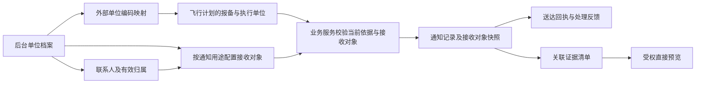

# 证据直接预览与单位通知关联修正方案

日期：2026-09-16。状态：用户批准范围内的代码与隔离验收完成；当前业务服务未在本任务中重启或迁移。

用户最新修正：风险统一“通知上级”，不区分单位、区域或风险类型。下文单位关联及用途配置仅在相应业务适用，风险不增加职责单位选择或区域/类型分发。

本方案依据本轮可读的前后台工作区、已保存的原材料摘录及后续用户决定编写。工作区存在其他任务的修改；源码核对不等于运行验收。原文中的静态核对结果保留为修改前基线，实际完成情况以后续交付记录为准。

## 1. 修正目标与推荐做法

完成后，值班员在告警详情、处置材料和证据管理中，点击图片就看到大图和证据信息；管理员在后台维护一次单位、联系人及通知用途，前台即可显示计划属于谁、应通知谁、使用什么渠道、是否送达。

推荐采用“共享预览能力 + 单位资料关联 + 按用途配置接收对象”，分两条工作线并行实施，最后跨模块验收。

| 可选做法 | 收益与代价 | 结论 |
| --- | --- | --- |
| 共享预览能力，补齐单位、人员、来源与接收对象关联 | 复用现有组织、证据、交接和通知记录；需要前后台共同调整契约 | 推荐，能同时修正交互与数据断点 |
| 只在文件详情加图片，表单增加单位和电话文本 | 工作量较小，但授权、跨页一致性和历史关联仍不完整 | 只能作局部补丁，不能作为这两项的最终交付 |
| 重建独立单位平台和统一通知中心 | 后续扩展空间较大，迁移及流程改造范围也明显扩大 | 本次不采用 |

范围包括业务前台 `dongying-vue/` 和同级后台仓库 `houtaiguanli/server/`、`houtaiguanli/ruoyi-ui/`。单位档案和通知配置放在后台系统管理范围；业务前台保留业务摘要与操作。六个旧管理哈希地址继续显示迁移提示。

## 2. 依据与当前差距

| 项目 | 已确认的要求 | 本轮源码核对结果 | 修正落点 |
| --- | --- | --- | --- |
| 直接看证据 | 图片点击后直接显示图像和证据信息，减少多层弹窗 | `evidenceFileDetail.js` 主要渲染元数据与下载；`evidenceApi.js` 只有内容下载方法 | 列表、证据链直接定位同一预览组件 |
| 预览授权 | 预览与下载分别校验权限 | 内容接口使用 `evidence:download`；访问日志目前没有独立预览动作 | 增加预览权限、受控内容读取与预览审计 |
| 证据来源 | 展示采集时间、来源、位置与关联事件 | 现有详情有时间、来源模式和关联对象，缺少完整采集设备/位置字段 | 补可信来源字段；缺失明确标注 |
| 完整单位资料 | 单位类型、外部编码、联系人、职责可维护 | `app_org` 以名称、编码、上级为主，单位树在用户管理中；后续已取消单位停用 | 在现有组织 ID 上补业务资料与后台维护入口，联系人和通知绑定独立管理有效性 |
| 计划单位关联 | 计划单位、通知接收单位和联系人关联 | 计划 `operator_name`、`pilot_name` 为文本；`owner_org_id` 是数据归属，`source_id` 是技术来源 | 增加明确业务关联，保留原始申报文本 |
| 通知对象配置 | 按用途确定接收对象、渠道及送达要求 | `handoff_recipient` 是逻辑接收目录；计划反馈接收方绑定 `integration_source`；尚无完整配置页 | 补单位、联系人、端点、用途和适用范围关联 |

依据入口：

- [录音转写摘录 S5](交付/说人话逻辑架构-V2.1-20260914/依据摘录/S5.txt)：91.5–107.5 秒，直接显示图像与证据信息、减少弹窗。该文件是已有机器转写，本次未重新听录音。
- [客户评审修正要点](交付/客户评审修正-20260911/系统修正要点.md)：R07、R25、R26、R29，规定直接预览、单位档案及通知配置目标。
- [无人机劝离处置](backend-stage19/uav-advisory-workflow.md)：2026-09-16 后续决定，短信对象指飞手提醒/劝离，后台预案配置仍待实现。
- 两级 AGENTS：自动研判、权限与动作解耦、历史保留、跨模块关联和完整文字展示。

后续实现修订优先：后台 `V202609130001__reactivate_all_organizations.sql` 明确“单位不再提供停用能力”。本次不沿用早期方案恢复单位停用；联系人、外部映射和通知绑定的有效期/可用性独立维护。

关键源码定位：

| 核对项 | 当前文件 |
| --- | --- |
| 证据类型弹窗、文件信息及下载路径 | [evidenceChainView.js](/Users/frank/Desktop/dongyiwurenji/dongying-vue/src/ui/evidenceChainView.js:68)、[evidenceFileDetail.js](/Users/frank/Desktop/dongyiwurenji/dongying-vue/src/ui/evidenceFileDetail.js:132) |
| 内容接口与授权审计 | [EvidenceController.java](/Users/frank/Desktop/houtaiguanli/server/src/main/java/com/uav/lowaltitude/modules/evidence/api/EvidenceController.java:74)、[EvidenceAssociationService.java](/Users/frank/Desktop/houtaiguanli/server/src/main/java/com/uav/lowaltitude/modules/evidence/application/EvidenceAssociationService.java:341) |
| 计划原始单位/飞手文本与前台展示 | [FlightDtos.java](/Users/frank/Desktop/houtaiguanli/server/src/main/java/com/uav/lowaltitude/modules/flight/api/FlightDtos.java:36)、[PlanFilingDetails.vue](/Users/frank/Desktop/dongyiwurenji/dongying-vue/src/pages/flights/components/PlanFilingDetails.vue:28) |
| 计划反馈接收来源校验 | [FlightVerificationService.java](/Users/frank/Desktop/houtaiguanli/server/src/main/java/com/uav/lowaltitude/modules/flight/application/FlightVerificationService.java:99) |
| 交接目录及历史名称读取 | [接收目录建表](/Users/frank/Desktop/houtaiguanli/server/src/main/resources/db/migration/V202609050031__handoff_submission.sql:1)、[HandoffRepository.java](/Users/frank/Desktop/houtaiguanli/server/src/main/java/com/uav/lowaltitude/modules/handoff/infrastructure/HandoffRepository.java:205) |
| 后台单位入口与停用取消 | [UsersView.vue](/Users/frank/Desktop/houtaiguanli/ruoyi-ui/src/views/system/UsersView.vue:183)、[单位能力修订迁移](/Users/frank/Desktop/houtaiguanli/server/src/main/resources/db/migration/V202609130001__reactivate_all_organizations.sql:1) |

## 3. 页面定位与业务链

| 页面及模块 | 主要使用者 | 承接输入 | 输出与完成条件 |
| --- | --- | --- | --- |
| 证据管理／文件列表、内容预览 | 有证据权限的业务人员 | 在库证据、关联对象、文件状态 | 能直接查看可用内容与来源；异常有原因及恢复入口 |
| 告警、风险、处置材料／证据区 | 当前事项处理人员 | 当前事项明确关联的证据 ID | 在当前业务上下文查看证据，返回后保留筛选和选择 |
| 后台单位管理／档案、联系人、来源映射 | 获授权管理员 | 既有组织、业务单位资料、外部编码 | 形成稳定单位与人员关联，供计划及通知解析 |
| 后台通知配置／对象与用途规则 | 获授权配置人员 | 单位、联系人、已有渠道/模板及明确业务关联；风险固定上级 | 形成版本化且可校验的接收对象配置 |
| 飞行计划／单位摘要、检查与通知 | 值班员 | 计划原始资料、来源映射、当前通知配置 | 显示报备单位、接收单位和关联理由；回读同一检查的通知 |
| 风险、告警、处罚／通知与记录 | 相关业务人员 | 各自有效业务依据与相应用途配置 | 保留发送、送达、确认、处理反馈和历史快照 |

图中箭头表示明确关联和消费关系；不表示所有用途都自动发送，也不改变既有反制和处罚授权条件。

## 4. 本次模块清单与处理规则

以下编号仅用于本方案追踪，不新增业务编号或导航层级。表格覆盖本次新增和修改的模块，不重写现有整页功能。

| 模块 | 输入、出现条件与处理 | 操作及输出 | 消费方、异常与验收重点 |
| --- | --- | --- | --- |
| EV01 证据清单与缩略图 | 读取当前事项证据集合、文件状态及预览能力；按采集时间和稳定 ID 排序；仅请求可见项缩略图 | 点击直接选中该文件；类型仅作筛选，不作进入详情的前置步骤 | EV02 接收文件 ID、集合及来源上下文；空集合显示没有关联证据，403 不泄露缩略图 |
| EV02 共享内容预览 | 服务端校验后读取当前文件；按可信格式选择图片、文档、录像或文本展示 | 放大、缩小、上一项、下一项、返回；独立下载动作仍检查下载权限 | EV03 同步当前文件元数据；切换和关闭取消旧请求并释放资源；不能串入上一事件内容 |
| EV03 证据来源及保管信息 | 元数据和关联记录与 EV02 使用同一证据 ID | 展示采集/入库时间、来源、位置、事件；按权限保留原有保管和下载动作 | 返回当前事项或证据台账；冻结/销毁仍沿用原服务，不因打开预览变更状态 |
| OR01 单位档案 | 复用组织 ID，读取资料和业务职责；只对授权范围可编辑 | 保存资料、查看关联影响；记录版本及变更审计 | OR02、OR03、NR01 使用同一单位；建档不开户、不授权、不自动增加数据可见范围 |
| OR02 单位联系人 | 单位下的联系人、角色、有效期与可选账号关联 | 保存、停用、结束任职；手机号按权限显示；不以姓名自动合并 | NR01 仅可选有效且适合用途的联系人；历史接收人快照不变 |
| OR03 外部来源映射 | 来源系统 ID、外部单位编码及原始名称；允许一来源服务多个单位 | 保存精确映射，列出待关联及冲突项 | BP01 使用已确认映射；重名不自动合并，缺编码进入待关联处理 |
| NR01 通知对象与用途 | 用途、接收单位/人员、渠道端点、模板版本、适用范围、有效期 | 编辑、校验、启用/停用；沿用每项业务原有的接收方数量约束 | 业务服务解析接收对象；不能把同一个默认接收单位用于全部业务 |
| NR02 配置诊断及变更影响 | 读取配置完整性、关联记录和既有渠道状态 | 校验适用对象、查看阻断原因和受影响待发任务；配置检查本身不发送 | NR01 修正后重新校验；未接通显示未接通，不显示送达成功 |
| BP01 计划与接收对象摘要 | 读取计划原始资料、关联单位、用途配置和版本 | 查看单位资料与关联依据；沿用现有检查及通知操作 | BP02 接收该次检查/通知的明确 ID；缺配置只阻断依赖它的通知，不抹去检查事实 |
| BP02 通知记录与反馈 | 读取原业务通知/交接、尝试记录、对象快照、回执及反馈 | 查看进度、按后端条件继续/重试、预览附件 | 原计划、风险、告警或处罚模块回读相同事实；刷新/重新登录保持一致 |

所有模块均无新增 AI 处理。既有自动研判继续按原服务工作，本方案不以模型推断建立正式单位关系或授予动作权限。

## 5. 证据直接预览设计

**交互。** 证据管理选中文件后，主内容区直接显示预览；告警、风险和处置详情点击缩略图后，在现有详情容器切换为预览视图，保留返回入口。只有没有现成详情容器的入口才使用一个共享预览弹窗。不得出现“选择类型 → 文件列表弹窗 → 文件详情弹窗 → 下载”的链条。

预览旁直接显示文件名称、采集时间、来源设备或系统、采集位置、关联事件及来源模式。哈希、保管链等放可展开区域，完整可读。上一项/下一项限定在当前有权访问的证据集合，显示当前位置；翻页不改变所属事项。模拟录像或图像始终显示来源标记。

| 内容类型 | 本次建议能力 | 无法预览时 |
| --- | --- | --- |
| 经校验的 JPEG、PNG、WebP | 缩略图、原图、缩放及前后切换 | 保留元数据，区分缺失、损坏、无权限和加载失败 |
| PDF | 在受控预览区打开浏览器支持的 PDF 内容 | 浏览器不支持时明确说明，下载按独立权限开放 |
| 浏览器可解码的在库录像 | 播放/暂停、进度和全屏；标明录像及采集时间 | 编码不支持显示具体原因；不以静态图冒充视频 |
| JSON／纯文本材料 | 以文本或结构化内容展示，防止脚本执行；大文件限制单次展示量并支持完整读取 | 不将真实 JSON 文件误判成 API 包装对象 |
| 轨迹快照 | 已有可信轨迹结构可复用现有轨迹展示；保留时序、断点和来源 | 无可靠几何时看原始结构化记录，不生成轨迹 |
| Office、压缩包、未知或主动内容格式 | 展示元数据，提示当前格式不支持内嵌预览 | 按权限下载；不在首期新增在线 Office 转换或流媒体平台 |

**内容接口。** 建议追加预览能力/内容读取契约及 `evidence:preview` 权限，保留现有下载契约与 `evidence:download`。预览、缩略图和下载共用证据范围校验；持有事件读取权限不能自动读取其所有附件。预览原件传给浏览器本身即包含内容读取能力，不承诺防截屏或绝对禁止另存。

前端受权请求使用现有 Bearer 会话，不能把 token 放入 URL。当前入库上限为 32 MiB，首期采用受权获取后的临时对象 URL，并验证上限附近文件的等待、取消、内存及录像拖动；只加载当前原件，缩略图使用受限并发。退出预览释放 URL，关闭或切换立即停止播放器和迟到请求。若后续确需更大录像，再评估 Range 和受控媒体票据，不把新增流式基础设施作为本次默认范围。

新请求始终重新检查权限，会话失效时页面清理已显示内容。已交给浏览器的字节无法从客户端强制收回；界面清理不能被描述为绝对撤回已读取内容。不得暴露对象存储永久地址。

后端按可信 MIME/文件头及允许格式判断，不能只信上传方 `Content-Type`。缩略图是关联原件及原哈希的派生内容，原件缺失、损坏、销毁或无权时不得继续当作正常可用内容展示。受保护内容不进入公共缓存；缩略图权限与预览权限一致。

审计新增预览和缩略图读取语义，与下载区分。审计“服务端已提供内容”和“前端已加载显示”不能混为一谈；缩略图批量读取关联本次浏览行为，避免被当作多次人工下载。原有 VIEW/DOWNLOAD/VERIFY/EXPORT 历史保留。拒绝访问的审计须在业务异常回滚后仍可查；现下载代码存在同事务写日志后抛异常的风险，实施时实库验证，不直接复制为预览拒绝日志的写法。

## 6. 单位、人员与计划的关系

推荐保留 `app_org.org_id` 作为现有组织标识，用业务资料扩展表承接档案；具体新增字段/表名为实施建议。外部单位建档不能改动既有数据归属或角色范围，尤其不能因挂入组织树而隐式扩大可见范围。

| 对象 | 建议字段与关系 | 必须保持的语义 |
| --- | --- | --- |
| 单位档案 | 稳定 ID、名称、单位类型、统一标识（适用时）、地址、业务职责、版本；复用既有上级关系 | 企业只是单位的一种；单位存在不代表有登录账号或平台权限；不恢复单位停用 |
| 外部单位映射 | `source_id + external_org_code → org_id`，含映射依据、有效期和原始名称 | 来源系统不是单位；一个系统可报送多个单位；名称仅用于显示与人工核对 |
| 单位联系人 | 独立联系人 ID、所属单位、姓名、岗位/联系用途、联系方式、有效起止及状态，可选关联账号 | 联系人不自动开户；离职/调岗结束旧关联；同名不等于同一人 |
| 计划业务关联 | 明确报备/执行单位关联，保留 `operator_name` 原始文本和关联状态；需要区分报送单位时单独记录 | `owner_org_id` 继续表示数据范围；`source_id` 继续表示技术来源，二者不改作业务单位 |
| 飞手关联 | 保留 `pilot_name`，在有可信外部身份时关联明确的飞手身份及有效联系方式 | 普通单位联系人不是默认飞手；只有姓名不能自动通知到某个手机号 |
| 通知接收对象 | 用途、接收主体类型、单位 ID、可选联系人/飞手身份 ID、端点引用、范围、有效期及版本 | 单位级 HTTP 接收可不指定个人；个人短信必须有明确适用身份和有效号码 |

前台“报备单位”旁展示关联情况；打开可看完整单位摘要与适用联系人。原始申报名称和当前档案名称不同，分别标为“申报时名称”和“当前名称”。未关联时显示原始名称与“单位档案待关联”，不拼接一个貌似有效的单位 ID。

单位改名保留旧 ID、别名、历史记录和操作依据。重复档案先进入映射核对，不在此次增加批量单位合并操作；不批量改写旧计划、交接材料或通知快照。联系人调岗、离职或通知关系失效通过对应关联处理，不停用整个单位、不自动迁移账号权限。

现有计划反馈已存接收名称，现有交接列表却通过实时 JOIN 读取接收目录的当前名称，存在改名后历史显示变化的问题。新增改名能力前，应为新通知冻结接收单位、联系人、渠道及配置版本；旧记录只依据可证明的历史材料恢复名称。无法证明的标明“原接收名称未冻结”，可另展示当前目录名称，不能把今天的联系人回填为当年接收人。原冻结材料保持原样，必要的兼容快照另行存储并标明回填依据和时间。

## 7. 通知对象按用途配置

后台“通知配置”提供对象、适用用途/范围、渠道与端点、模板版本、回执要求、有效期和状态。现有渠道/模板能力优先复用；端点凭据只存后台受控配置，前台仅展示渠道名称及可用性。

| 用途 | 接收对象来源 | 前台消费模块 | 保留的发送条件与结果 |
| --- | --- | --- | --- |
| 计划检查结果反馈 | 该计划明确报送单位及其对应的来源系统端点 | 飞行计划／自动检查与通知 | 关联本次检查/核实 ID；继续保留提交、送达、确认及处理反馈 |
| 异物、气象风险通知上级 | 统一的“上级”接收端 | 飞行计划风险详情、空域监测／通知与回执 | 沿用当前核验与交接条件；不选择单位，不按区域/风险类型分发 |
| 飞手提醒/劝离短信 | 当前目标/计划可核实的飞手身份和有效联系方式 | 告警、融合感知／飞手短信记录 | 沿用有效研判、时效及授权策略；身份不清阻断，不回退通知单位值班人 |
| 处罚材料移送 | 独立配置的处罚接收单位 | 告警／移送；处置与处罚／交接材料 | 继续检查权限、版本和材料条件；上级风险接收方不自动兼任处罚接收方 |
| 设备异常通知 | 设备既有运维责任及对应后台待办范围 | 飞行计划／设备异常；后台／运维待办 | 继续生成同一业务待办并防重；待办完成不等于设备已恢复 |

对象解析优先使用明确业务关联，再核对用途、渠道和有效期。风险固定“上级”接收端，不匹配单位、区域或风险类型；处罚仍由有权人员明确选择，计划反馈仍限定该计划来源对应的对象。单用途有多个冲突配置时明确阻断，不任取第一条。本次保持单接收对象，不加入并行投递或自动备选切换。

后台配置保存不发送通知。“校验配置”检查字段、用途和解析结果，不发真实短信或 HTTP 业务通知。真实通道验证单独记录验证范围和实际结果。

## 8. 页面内部关联矩阵

| 来源模块 | 触发及数据 | 目标模块 | 结果 | 改变业务状态 |
| --- | --- | --- | --- | --- |
| EV01 | 点击证据 ID 与当前集合 | EV02、EV03 | 内容与来源同步定位，返回保留位置 | 否；产生内容访问审计 |
| EV02 | 前后切换或加载失败 | EV03、EV01 | 更新元数据/当前位置或显示该文件异常 | 否 |
| OR01 | 保存单位版本 | OR02、OR03 | 更新当前单位摘要；保持旧 ID | 修改档案，不改历史业务 |
| NR01 | 修改对象、用途、渠道或范围 | NR02 | 重新检查完整性、冲突及受影响任务 | 草稿保存；通过启用动作后影响未来解析 |
| BP01 | 提交现有业务通知命令 | BP02 | 回读该次通知进度与对象快照 | 按原服务状态机 |
| BP02 | 受控重试、回执或反馈更新 | 当前事项摘要与时间线 | 显示同一任务的尝试及实际结果 | 按原服务状态机 |

## 9. 跨页面模块关系矩阵

| 上游模块 | 输出 | 下游模块及消费方式 | 回流及异常 |
| --- | --- | --- | --- |
| 后台 OR03 来源映射 | 来源+外部编码的精确单位映射、版本 | 计划 BP01 解析报备/执行单位，展示来源 | 无映射保留原始值，后台待关联清单可查 |
| 后台 OR01、OR02 档案联系人 | 单位/联系人 ID、联系人状态和有效期 | NR01 配置可选接收对象 | 联系人停用触发影响提示，历史对象仍能查 |
| 后台 NR01 有效配置 | 用途、范围、对象、端点及版本 | 计划、风险、告警、处罚的 BP01/BP02，通过各自业务服务消费 | 无适用规则或规则冲突显示具体阻断原因 |
| 业务 BP02 提交通知 | 业务 ID、检查/材料版本、接收快照、发送任务 | 通道适配及原业务通知/交接记录 | 失败保留原任务；未知结果先核对，不能盲目新建 |
| 通道回执与处理反馈 | 任务/尝试 ID、真实时间、状态 | 同一事项 BP02 和历史时间线 | 送达、确认收到、处理结果分别展示 |
| 告警/风险/处罚 EV01 | 精确证据 ID、事项上下文 | 共享 EV02、EV03 | 无权限只提示受限；不展示其他事项附件 |
| BP02 的证据引用 | 通知材料、回执附件 ID | 证据管理 EV01、EV03 | 可由证据回溯原通知；迟补材料不覆盖冻结快照 |

## 10. 关键字段血缘与历史保存

| 关键字段 | 首次来源 | 当前与未来消费 | 修改及历史规则 |
| --- | --- | --- | --- |
| 证据采集位置/设备/时间 | 采集载荷或带来源说明的入库记录 | EV02/EV03 展示取证当时事实 | 不使用当前目标位置替代；补录保留补录时间与来源 |
| 单位名称、类型、职责 | OR01 授权保存 | OR03、NR01、BP01 | 当前摘要更新；旧申报、旧通知快照保留 |
| 联系人归属及联系方式 | OR02 授权保存或可信同步 | NR01 选择、通知服务解析 | 有效期版本化；敏感信息按权限读取，审计不明文扩散号码 |
| 计划业务单位 ID | 来源编码精确映射或有审计的人工关联 | BP01 与用途匹配 | 不替换原始申报文本和数据归属字段 |
| 接收方与端点版本 | NR01 有效配置经业务服务解析 | 待发任务、BP02 | 提交时冻结；重试不悄悄更换对象 |
| 模板和材料版本 | 原通知模板/材料服务 | 通道发送及证据引用 | 固化当次内容，不回写旧交接材料 |
| 投递/回执/处理时间 | 实际通道回执与业务反馈 | BP02、原统计消费者 | 使用原同源事实；本次不重定义统计指标 |

## 11. 动作、副作用和自动化边界

| 动作 | 前置条件与写入 | 失败、幂等与下游 |
| --- | --- | --- |
| 打开预览/缩略图 | 预览权限、数据范围、可用原件；读取内容并写访问审计 | 重读不改变保管状态；禁止与 DOWNLOAD 混记 |
| 下载 | 下载权限、范围与原件状态；沿用下载审计 | 预览成功不自动授予下载动作 |
| 保存单位/联系人/映射 | 管理权限、可编辑范围、版本及唯一性校验 | 事务失败不部分保存；冲突重读后合并，保留操作者及变化 |
| 启用通知配置 | 引用有效、用途允许、范围明确、端点完整、版本校验 | 配置与通道连通性分开显示；缺少关键字段不启用 |
| 停用或改接收对象 | 展示引用影响，保存新版本 | 新任务重新解析；既有待发任务按下述规则处理 |
| 提交通知或异常重试 | 各自原业务门槛、当前有效依据、对象配置及动作权限 | 保留各业务现有幂等与唯一性粒度；超时先核对；保留各次尝试与快照 |

防重不能统一简化为“计划 + 用途 + 接收对象”：计划反馈必须关联该次 `verification_id`，下次检查允许按原规则形成新反馈；交接继续保留源事项、用途、接收方的现有唯一性约束，源版本用于提交有效性检查；自动短信保留一事件一自动任务。新增单位和联系人关联不重定义这些规则。

自动化六项约束：

1. **触发数据**：原业务服务已形成的有效检查、风险/违规依据、设备异常或移送命令。
2. **自动判定**：原状态门槛，加上通知用途、范围、对象身份、配置有效性和已有任务防重。
3. **数据时效**：继续校验原观测/研判时效；同时校验联系人、映射、配置的有效期。不同用途不强行共用一个超时时长。
4. **自动动作**：已支持自动发送的流程由后台解析对象、生成任务并投递；需要当前人工命令的流程保持原边界。页面只读刷新不能触发发送。
5. **人工介入**：单位/身份未关联、冲突、多义、失效、无可用渠道或执行异常；后台管理员修正配置，值班员看具体阻断依据。
6. **失败处理**：保留已生成任务和历史回执。配置恢复后，仅对依据仍有效、对象仍适用且未成功发送的任务按既有策略恢复；过期不自动补发，结果未知先对账。

## 12. 状态传播与异常恢复

| 对象/情况 | 呈现与处理 | 恢复路径 |
| --- | --- | --- |
| 文件加载中/无附件 | 当前文件加载状态；无附件是业务空态 | 加载可取消；空态不伪造缩略图 |
| 文件缺失/损坏/销毁 | 保留有权查看的元数据和不同原因，关闭内容读取 | 加载失败可重试；缺件按原入库流程补充，不覆盖原哈希 |
| 403 或会话失效 | 页面发现失效后停止展示并释放本页对象 URL | 后续内容请求重新鉴权；已交给浏览器的内容限制按第 5 节说明 |
| 单位未关联/映射冲突 | 原值保留，显示待关联或冲突 | 后台修正并审计；只自动补充唯一可信映射 |
| 单位用途绑定/联系人/渠道失效 | 未来通知不可选；显示受影响待发任务 | 重读有效配置，依据仍有效时按原规则继续 |
| 已提交但尚未发送时配置变化 | 发送前再次校验对象、配置和授权；原快照不静默替换 | 原任务标明阻断原因；需换对象时先核对旧投递，再按独立通知身份处理，见下文 |
| 发送结果未知 | 保留任务 ID、幂等键、尝试与未知状态 | 查询通道/回执后再决定重试，不能把超时直接当发送失败 |
| 已送达后联系方式/观测失效 | 仍显示原送达对象、时间及快照 | 新操作按当前配置校验；历史不改成未发送 |
| 并发修改/重复点击 | 版本冲突与处理中明确显示 | 重读后重试；相同命令返回既有记录 |
| 切换事项/离开页面 | 即刻清理旧选中内容与动作上下文 | 迟到响应丢弃，返回保留正确筛选；后台已提交任务继续执行 |

通知状态沿用现有 delivery、receipt、处理反馈及原业务状态，配置诊断不混入“送达/办结”。单位资料更新不会自动产生风险解除、反制授权或处罚结果。

更换接收对象不属于普通重试：先阻断旧任务并确认未投递；确需改发时，必须由原业务服务支持建立独立通知记录/投递身份并关联旧记录，且原任务不再自动发送。结果未知时先核对；原状态机不支持撤销待发或独立改发时保持阻断并显示处理原因，本次不通过新建 attempt 绕过一事件一自动任务或交接唯一性约束。

## 13. 权限与接口改动范围

服务端同时检查模块动作权限、数据范围、对象状态及用途适用性。后台单位/通知配置管理权限与前台业务读取/发送权限分开；联系人敏感字段另受范围和脱敏规则限制。建档、选接收方和修改组织层级均不能间接扩大账号数据权限。

| 层次 | 建议修改 |
| --- | --- |
| 证据后端 | 追加预览能力/缩略图/内容职责、格式校验、来源元数据与预览审计；共用既有范围、原件状态与存储逻辑，保持 32 MiB 上限 |
| 证据前台 | 新增跨页预览组件与会话资源清理；扩展 `evidenceApi.js`；保留 `evidenceFileDetail.js` 的保管与来源信息能力；证据链和文件列表改为直达 |
| 单位后端与后台 | 单位资料、联系人、外部编码映射、关联影响查询；扩展现有组织能力，后台增加完整维护入口，用户管理继续消费原组织 ID |
| 通知后端与后台 | 补接收对象 CRUD、用途/范围/有效期及渠道引用，返回解析结果、配置版本、阻断原因；复用现有任务/交接状态机 |
| 计划及相关前台 | 计划资料补单位关联摘要；检查通知显示明确单位及渠道；风险固定上级、处罚按用途选择；通知历史读快照 |

兼容要求：

- 遵守 `/api/v1`、Bearer 会话、snake_case、字符串 ID 及现有业务响应封装。预览二进制/文本与 JSON 业务包装明确区分；现 `apiBinary` 对 `application/json` 的分支不能原样用于 JSON 文件预览。
- 现 `flight_plan_feedback.recipient_id` 指向技术来源。保留其旧含义，追加明确单位/对象配置字段并扩展校验；不能把新单位 ID 塞进旧来源 ID 字段。历史记录仍用原名称和材料快照。
- 现 `handoff.recipient_id` 继续指向原逻辑目录；扩展目录关联单位及配置，不重建历史交接，也不复用停用 ID 代表另一个单位。
- 共用配置解析与预览服务即可，不重写所有业务通知为同一种状态机。前台和后台两个消费者同时更新并验证向后兼容。
- 后台角色配置须能配置新增预览/档案/通知权限，审计页面可读新动作。当前单位按钮使用 `users.op`，服务端写入要求 `users.auth`，本次相关入口应按服务端实际动作权限对齐，不扩大为全角色体系重构。
- 本次不新建生产依赖。浏览器原生能力不能满足的转码、文档转换另列扩展，不以模糊的“全格式支持”作为验收承诺。

## 14. 数据迁移与实施顺序

1. **先盘点与固化契约。** 形成单位、来源、接收目录、计划文本的映射清单及未关联原因；盘点真实文件格式、大小和预览样本；记录实际 Flyway 版本。这里只读，不向业务库补演示记录。
2. **追加后端基础。** 新迁移增加单位资料/联系人/映射/配置、关联字段和预览权限审计；不修改已应用脚本。旧 ID、外键、发生时间、快照及审计完整保留。
3. **并行完成两条工作线。** A：预览接口和组件，接入证据管理、告警/风险证据区、处置材料。B：后台单位/联系人/通知配置，接入计划业务单位及各用途的对象解析。
4. **先校验、后启用。** 新关联只有唯一可信映射可自动生成；同名、多来源冲突和飞手身份不明单列处理。原有有效流程兼容保留；缺乏真实对象或正式通道的用途维持明确阻断。新权限不给普通只读用户自动扩大内容访问。
5. **联调与验收。** 先隔离数据验证迁移、权限和完整链，再浏览器检查跨页一致性；真实媒体和真实通道单列验收证据。部署后核对前后台指向同一新版后端与数据库。

迁移前备份受影响记录并记录行数、关联及快照指纹；迁移后核对历史可读、外键和幂等。回退优先停用新增能力并回退兼容代码，不删除已经生成的新业务记录或回执。正式启用接收配置之前，完成组织树与数据范围影响检查。

## 15. 端到端验收标准

| 编号 | 场景 | 通过标准 |
| --- | --- | --- |
| E01 | 从告警点击真实可辨识图片，再从证据管理打开同一文件 | 一次点击直达图像与元数据，两个入口显示同一证据和关联；无需下载 |
| E02 | 当前事件有多张图，快速前后切换、切换事件、关闭再开 | 顺序和元数据对应，无串图、迟到弹窗；返回保留列表上下文 |
| E03 | 预览允许但下载不允许；反向组合；越权证据 | 分别执行各权限；直接请求内容/缩略图同样不能越权；审计动作准确，拒绝日志经真实事务回滚后仍可查 |
| E04 | 文件缺失、损坏、销毁、格式不支持、401/403、超时 | 各原因独立显示，不以占位图冒充原件；可恢复失败有正确入口 |
| E05 | PDF、JSON、文本、可播放录像及接近 32 MiB 的文件 | JSON 不被吞为 API 响应；主动内容不执行；录像可播放与拖动，加载可取消，关闭释放资源 |
| E06 | 只有时间和来源模式、没有采集位置的旧证据 | 显示缺失，不显示当前目标位置或虚构设备；原始材料/哈希不变 |
| O01 | 后台建单位与联系人，关联一份计划 | 前台显示同一单位资料；联系人不自动变成账号，数据权限不增加 |
| O02 | 一个来源系统报送两个单位；同名单位不同外部编码 | 按来源+编码正确关联，不能按系统或名称合并 |
| O03 | 修改单位名称、联系人调岗或停用 | 当前档案正确；新通知显示发送时对象，旧记录按可信历史显示且不伪造快照；单位停用未被恢复 |
| N01 | 配置计划反馈、统一上级接收端和处罚移送对象 | 风险无单位/区域/风险类型选择；其他业务解析自身关系，前台摘要与后台配置一致，回执关联原记录 |
| N02 | 单位联系人存在，但飞手身份或号码未知 | 飞手短信明确阻断，不通知单位联系人冒充已通知飞手 |
| N03 | 唯一适用配置、多个重叠默认、处罚未明确选择分别执行 | 唯一配置正确；重叠配置阻断；处罚未明确接收方不能提交 |
| N04 | 双击、两人并发、超时重试及重复回执 | 任务防重、回执幂等；未知先核对；不产生重复真实投递 |
| N05 | 排队后停用接收对象或更换号码 | 发前校验生效，不向失效对象发送、不静默替换原快照 |
| N06 | 已送达后依据过期、联系人变化 | 送达历史保持；不会显示从未发送，也不推导已读、飞离或办结 |
| N07 | 关闭前台页面后等待已有自动通知任务 | 后台仍按原有效策略执行；页面读取本身不发送；刷新与重新登录看到同一结果 |
| N08 | 同一计划连续产生两次不同检查结果，各自反馈同一来源 | 两次反馈分别关联各自检查 ID，重试只去重本次提交，不吞掉下一次合法反馈 |
| N09 | 待发记录需要换接收人，旧投递结果未知或原业务不支持改发 | 保持旧记录与快照，先核对或明确阻断；不能作为同任务普通重试向新人发送 |
| X01 | 从通知附件预览，再从证据反查原事件/交接 | ID、来源、时间、接收快照一致；迟补附件不改冻结材料 |
| X02 | 1280×720、1366×768、1440×900/1024，长名称/编号 | 内容完整，无省略截断、静默裁切、重叠和整页横向滚动；键盘可操作 |

测试样本须是可辨识的测试图、有效 PDF、真实编码的录像和有内容的结构化文件，明确测试来源。现有 1×1 图片及不可用录像样本不足以证明预览体验通过。模拟短信只证明模拟链路；正式 HTTP/短信与设备媒体分别记录实测结果。

实施时按仓库规范执行：前台 `npm run build`、`node tools/scan.cjs`、`npx playwright test e2e/admin-migration.spec.js`；后台完成受影响服务/权限/迁移/通知状态测试，管理前端构建及浏览器验证；两个仓库 `git diff --check`。如实际执行等效入口或存在失败，记录命令和原因，不引用旧测试结果充数。

## 16. 交付条件与实施前核对项

两项完成必须同时满足：证据从业务入口直接可看；单位、联系人、来源与接收配置有稳定关联；每次通知能解释“为何通知这个对象”，并保留当时快照和实际结果。

本方案采用的默认范围：单位类型和业务职责按可配置字典组织；先接入现有业务的通知用途；支持图片、PDF、在库可播录像及文本/JSON预览；后台配置管理、前台业务消费；不扩展独立企业门户、实时视频平台或新处罚审批流程。

实施前通过现有接口资料与运行环境核对：正式单位类别及权威编码、飞手身份和联系方式来源、各用途的正式接收单位/端点、真实通道回执协议、目标浏览器与常见文件大小。这些信息可影响配置值及媒体读取方式；缺失部分保持待关联/未接通，不阻断可独立完成的档案、预览、权限与模拟验收工作。

以上静态现状描述是制定方案时的基线。后续实施、测试和运行环境边界见[修正交付记录](交付/证据预览与单位通知关联-20260916/交付记录.md)，不能将方案阶段的“未运行验证”作为实施结论。
